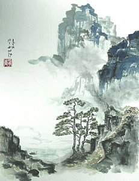

# Noisy Terrain - Hanyu Liu (liuhanyu)

## Inspiration

## Live Demo Link
https://helenl9098.github.io/hw01-noisy-terrain/

## Implementation Details

- __Overall Terrain__: The distribution of Mountains, Lowlands, Algae, and Water is determined by a FBM noise function, where the higher the fbm value, the higher the terrain (0.0 maps to water and 1.0 maps to mountains).

- __Mountains__: 
- __Lowlands__:
- __Algae__:
- __Water__:

## External Resources

